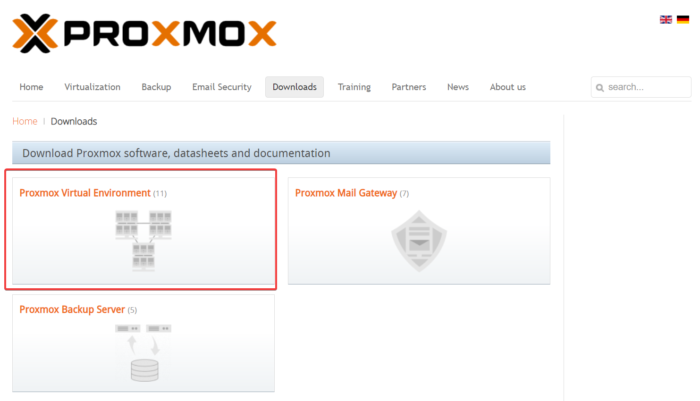

Hey ! Bon, beaucoup de personnes m'ont demandé comment je gère mes applications chez moi, comment est fait mon homelab. Seulement quand je leur parle de Proxmox, ils ne sont pas convaincus ou ont peur de se lancer.
Donc aujourd'hui, je vais vous apprendre à installer Proxmox, et on fera une petite visite et présentation des fonctionnalités.

# Comment Installer Proxmox ? (et petite visite de interface)

Alors on va déjà introduire cette doc par :

### Pourquoi utiliser Proxmox ?

C'est vrai ça, pourquoi utiliser Proxmox et ne pas directement installer un Windows Server ou un Linux sur la machine ?
Déjà, on va pouvoir enlever tout les préjugés : 

- Proxmox **ne consomme pas la moitié de la ram** de votre système. Une installation propre devrais **prendre pas plus que 800mb** de ram.
- Proxmox **ne consomme pas non plus 1 coeur de cpu** constament. C'est une couche très très légère.

Maintenant qu'on vois qu'il ne prends presque rien en ressource, pourquoi l'utiliser ducoup ? Si c'est une simple couche très légère, on en a sûrement pas besoin.... Eh ben vraiment ! Proxmox est bourré d'utilitaires et petites fonctionnalités sympa :

* **Les sauvegardes** : On peut sauvegarder la nuit sans arrêter notre machine et la restaurer en cas de problème très rapidement (snapshots).
* **Scalable** : On peut avec modifier les specs d'une VM très facilement et bien départager nos ressources entre nos VM.
* **LXC** : Au lieu de devoir installer manuellement nos machines manuellement une par une, on peut économiser des ressources et lancer des installs en un clic.

Alors, convaincu ? Maintenant, en ce qui en est des requirements y'a pas forcément grand chose d'important. Un processeur classique qui supporte windows et un peu de RAM et tout devrais bien fonctionner.

### On l'installe comment ?

Alors déjà il va falloir se munir de l'iso sur leur [site internet](https://www.proxmox.com/en/downloads)

