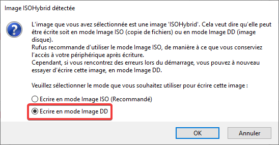
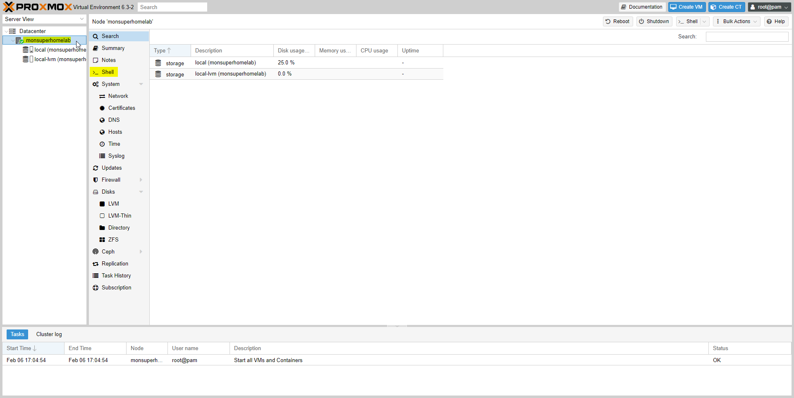
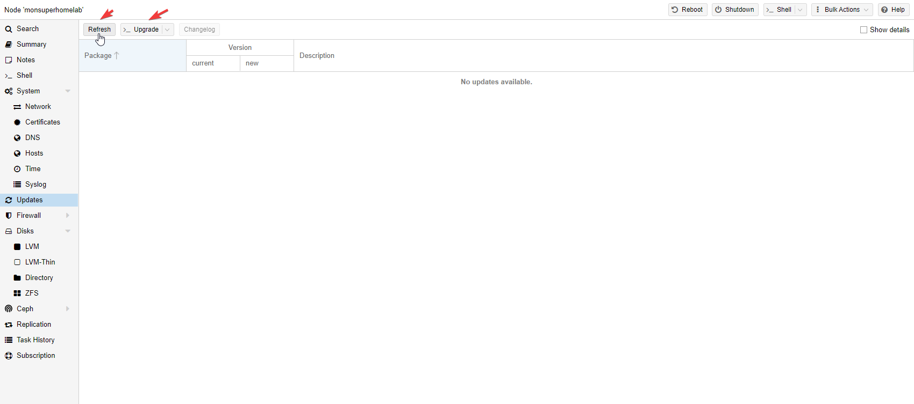

Hey ! Bon, beaucoup de personnes m'ont demandé comment je gère mes applications chez moi, comment est fait mon homelab. Seulement quand je leur parle de Proxmox, ils ne sont pas convaincus ou ont peur de se lancer.
Donc aujourd'hui, je vais vous apprendre à installer Proxmox, et on fera une petite visite et présentation des fonctionnalités.

# Comment Installer Proxmox ? (et petite visite de interface)

Alors on va déjà introduire cette doc par :

### Pourquoi utiliser Proxmox ?

C'est vrai ça, pourquoi utiliser Proxmox et ne pas directement installer un Windows Server ou un Linux sur la machine ?
Déjà, on va pouvoir enlever tout les préjugés : 

- Proxmox **ne consomme pas la moitié de la ram** de votre système. Une installation propre devrais **prendre pas plus que 800mb** de ram.
- Proxmox **ne consomme pas non plus 1 coeur de cpu** constament. C'est une couche très très légère.

Maintenant qu'on vois qu'il ne prends presque rien en ressource, pourquoi l'utiliser ducoup ? Si c'est une simple couche très légère, on en a sûrement pas besoin.... Eh ben vraiment ! Proxmox est bourré d'utilitaires et petites fonctionnalités sympa :

* **Les sauvegardes** : On peut sauvegarder la nuit sans arrêter notre machine et la restaurer en cas de problème très rapidement (snapshots).
* **Scalable** : On peut avec modifier les specs d'une VM très facilement et bien départager nos ressources entre nos VM.
* **LXC** : Au lieu de devoir installer manuellement nos machines manuellement une par une, on peut économiser des ressources et lancer des installs en un clic.

Alors, convaincu ? Maintenant, en ce qui en est des requirements y'a pas forcément grand chose d'important. Un processeur classique qui supporte windows et un peu de RAM et tout devrais bien fonctionner.

### On l'installe comment ?

Alors déjà il va falloir se munir de l'iso sur leur [site internet](https://www.proxmox.com/en/downloads)
On prends bien le **Proxmox Virtual Environment** et la version la plus récente sous forme d'iso (6.3 à l'heure actuelle)


Une fois qu'on a récupéré notre ISO il va falloir créer notre clé USB d'installation depuis le logiciel [Rufus](https://rufus.ie) 
Seulement attention, quand vous aller lancer le flash, n'oubliez pas de sélectionner **le disque en mode DD**



Une fois notre clé USB prête, on va pouvoir la brancher sur notre ordi (ou serveur) et démarrer dessus depuis le bios.


On accepte les conditions générales d'utilisation


Juste au-dessus, il nous demande sur quel disque on va installer Proxmox. Ici, je vais faire un tutoriel pour un setup avec 1 seul disque. Normalement (si j'ai pas la flemme) vers la fin du tuto je vais montrer plein de trucs utiles sur Proxmox :3
Bref, ducoup on séléctionne le bon disque et pas touche aux options, on laisse les trucs par défaut. Normalement pour une personne lambda on ne devrais pas avoir besoin de plus de choses. Puis on clique sur next.


On est bien français de france ...


Ici, on est entrain de définir le mot de passe root. N'oubliez pas qu'on est sur un installateur linux et qu'il peut avoir des problèmes avec qwerty azerty.
En dessous il nous demande notre email. Si plus tard vous configurez les email, il aura la possibilité de vous informer si la backup s'est bien passée etc. On met une vrai email si jamais mais ce n'est pas forcément important.


Ici, il a automatiquement détecté une interface sur laquelle est branchée notre câble réseau. Par défaut il risque de récupérer une IP par le DHCP.
**Cette IP doit être fixe** et ne **changera pas** au cours du temps. Si automatiquement il a choisit une IP pas folle, choisissez plutôt un .250 ou quelque chose de simple à retenir.
En ce qui en est des DNS, on laisse ceux qui sont proposés naturellement. Sinon vous pouvez toujours opter pour la [Solution Cloudflare](https://1.1.1.1) 1.1.1.1


On note tout ce qui est affiché, on vérifie puis on clique sur install pour qu'il commence l'installation. Il devrais (si on a coché la case) redémarrer automatiquement dès qu'il a fini.


Hop, notre Proxmox viens de démarrer, on peut aller dessus depuis notre navigateur web. On peut partir de notre ordinateur il devrais se gérer tout seul, donc débranchez écran etc.


Et puis tadam ! Bienvenue sur Proxmox :o

### Comment bien le configurer ?

Quand Proxmox est installé, il n'as pas tout qu'est bien paramétré par défaut. On va déjà aller réparer nos mises à jour.
Rendez vous sur le nom de votre node à gauche :



Une fois notre shell de lancé, on va pouvoir exécuter les commandes suivantes : 

```
rm /etc/apt/sources.list.d/pve-enterprise.list
```


Puis ensuite on va rajouter les lignes suivantes dans `/etc/apt/sources.list` :

```
nano /etc/apt/sources.list
(on rajoute les lignes suivantes :)
deb http://download.proxmox.com/debian/pve buster pve-no-subscription
```


Une fois cette ligne ajoutée, on peut sauvegarder le fichier à l'aide de CTRL + X, Y, et ENTRÉE.
On peut maintenant cliquer sur Updates, dans la même catégorie où l'on a trouvé Shell.



Ici, on va d'abord cliquer sur **Refresh**, afin de rechercher les nouvelles mises à jour. Dès que TASK OK est affiché, on peut fermer la petite pop-up, puis cliquer sur Upgrade. Il va nous demander si oui ou non on veut procéder, on dis oui.


Une fois ces mises à jour terminer, notre Proxmox est totalement à jour et on va pouvoir effectuer une petite visite. Si vous souhaitez, vous pouvez redémarrer si vous le souhaitez. On va s'occuper d'une petite visites des nombreuses fonctionnalités que nous offre proxmox.